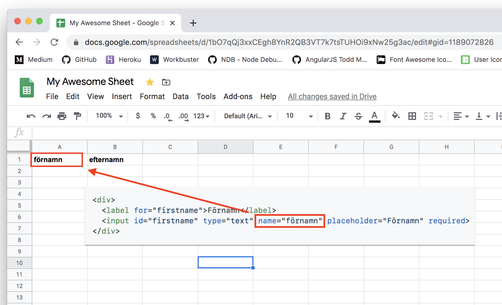

# sheet-forms

För att det ska fungera krävs tre saker:
1. Formuläret _ska_ ha ett id som matchar det spreadsheet som ska skrivas till

2. Spreadsheetet måste delas med `hillsong-forms-version-3@proven-aura-275720.iam.gserviceaccount.com` (edit krävs)

3. Spreadsheetet måste ha headers som matchar name-attribut i formuläret


----------------

### Kort om de olika attributen på elementen:

`name` måste finnas, name _måste_ stämma överens med en kolumn i ditt spreadsheet. Det finns alltid ett name som heter `created_at`, den behöver inte finnas i formuläret utan räcker om den finns i spreadsheetet.

`value` är det värde som kommer hamna i spreadsheetet. Framförallt för radioknappar, checkboxar och dropdowns. Går också att använda för att förifylla inputs.

`id` - om en label har `for`-attributet så kommer klick på labeln markera motsvarande id.
Mkt användbart för radioknappar och checkboxar då de kan vara svåra att träffa med musen.

`type` gäller endast input-taggen Användbara typer är `text, number, submit och email`, number får endast innehålla siffror, email måste ha giltigt email-format. Submit är den knapp som skickar iväg formuläret.

`placeholder` gäller endast input och textarea-taggen, den är grå text som syns i ett tomt inputfält, kan användas för att ge användaren ett hum om hur texten ska formatteras.

`required`, om required finns på ett formulärelement så måste något vara ifyllt för att man ska kunna skicka formuläret.

`maxlength och minlength` endast textarea– och inputelement, en siffra som bestämmer hur lång eller kort inputen får vara.

`rows columns` - endast textarea. Hur många rader hög eller bred textboxen ska vara (oftast bäst att skippa columns).

`selected` endast för dropdownens optiontagg. För att förhandsmarkera ett värde.

`checked` endast radioknappar och checkboxar, också för att förhandmarkera.

`disabled` inaktivt formulärelement.

----------------

Ett minimalt formulär:
```html
<form id="1bO7qQj3xxCEgh8YnR2QB3VT7k7tsTUHOi9xNw25g3ac" class="hillsong-form" style="text-align: left">
  <div>
    <label for="firstname">First name</label>
    <input id="firstname" type="text" name="firstname" placeholder="First name" required>
  </div>

  <input type="submit" value="Skicka">
</form>
<script>var el = document.createElement('script'); el.src = 'https://sheets-forms.netlify.app/.netlify/functions/script'; document.body.append(el);</script>
```

## Olika formulärelement

Textfält:
```html
<div>
  <label for="firstname">Förnamn</label>
  <input id="firstname" type="text" name="förnamn" placeholder="Förnamn" required>
</div>
```

Långt textsvar (text med flera rader):
```html
<div>
  <label for="long_text">This can be a long text with line breaks!</label>
  <textarea id="long_text" name="long_text" placeholder="This is the textarea placeholder text" rows="5" maxlength="160" required></textarea>
</div>
```

Dropdown:
```html
<div>
  <label for="campus">Campus</label>
  <select id="campus" name="campus" required>
    <option value="City" selected>City</option>
    <option value="Norra">Norra</option>
    <option value="Södra">Södra</option>
    <option value="Göteborg">Göteborg</option>
    <option value="Jönköping">Jönköping</option>
    <option value="Örebro">Örebro</option>

    <option disabled>—</option>
    <option value="Har inget campus">Har inget campus</option> 
  </select>
</div>
```

Radioknappar (envalsfråga):
```html
<div>
  <label><input type="radio" name="language" value="English" checked> English</label>
  <label><input type="radio" name="language" value="Swedish"> Swedish</label>
</div>
```

Checkboxar (flervalsfråga):
```html
<div>
  <input id="more_info" type="checkbox" name="more_info" checked><label for="more_info">I want more info</label>
  <input id="i_have_decided" type="checkbox" name="i_have_decided"><label for="i_have_decided">I have decided</label>
</div>
```


Fullt exempel:

```html
<form id="1bO7qQj3xxCEgh8YnR2QB3VT7k7tsTUHOi9xNw25g3ac" class="hillsong-form" style="text-align: left">
  <div>
    <label for="firstname">First name</label>
    <input id="firstname" type="text" name="firstname" placeholder="First name" required>
  </div>

  <div>
    <label for="lastname">Last name</label>
    <input id="lastname" type="text" name="lastname" placeholder="Last name" required>
  </div>

  <div>
    <label for="campus">Campus</label>
    <select id="campus" name="campus" required>
      <option value="City" selected>City</option>
      <option value="Norra">Norra</option>
      <option value="Södra">Södra</option>
      <option value="Göteborg">Göteborg</option>
      <option value="Jönköping">Jönköping</option>
      <option value="Örebro">Örebro</option>

      <option disabled>—</option>
      <option value="Har inget campus">Har inget campus</option> 
    </select>
  </div>

  <div>
    <label><input type="radio" name="language" value="English" checked> English</label>
    <label><input type="radio" name="language" value="Swedish"> Swedish</label>
  </div>

  <div>
    <input id="more_info" type="checkbox" name="more_info" checked><label for="more_info">I want more info</label>
    <input id="i_have_decided" type="checkbox" name="i_have_decided"><label for="i_have_decided">I have decided</label>
  </div>

  <div>
    <label for="long_text">This can be a long text with line breaks!</label>
    <textarea id="long_text" name="long_text" placeholder="This is the textarea placeholder text" rows="5" required></textarea>
  </div>

  <input type="submit" value="Skicka">
</form>
<script>var el = document.createElement('script'); el.src= 'https://sheets-forms.netlify.app/.netlify/functions/script'; document.body.append(el);</script>
```
